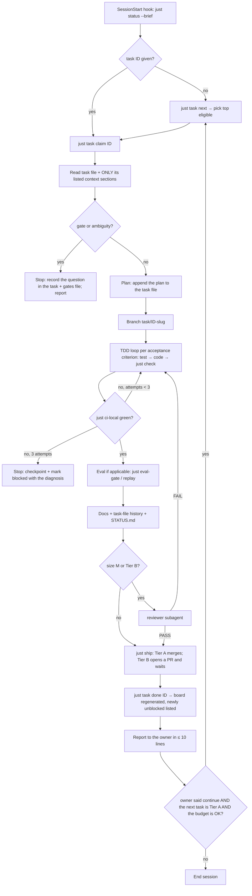

# Agent & Skill Architecture

Version 0.1 · 2026-09-24 · Status: **Proposed** (G-11, S-20, S-31). Standard: `docs/standards/agent-skill-development.md`.

## 1. Design stance

Specialist agents that each re-read the same context are the most expensive way to use Claude Pro.
This project therefore uses **one working session plus on-demand skills**. Separate agents are used only
where a fresh context window is worth what it costs.

| Mechanism | Used for | Token cost |
|---|---|---|
| **Scripts / `just`** | Anything deterministic: pick the next task, validate task files, lint/test/eval, regenerate the board, report status, ship | ~0 (only the output is read) |
| **Hooks** | Rules that must always hold: block destructive commands, auto-format edited files, inject a brief status at session start | ~0 |
| **CLAUDE.md** | Short, always-true orientation (≤ 150 lines) | Paid every session, so keep it tiny |
| **Skills** | Procedures (`/work-task`, `/status`, …) and area knowledge (`dbt`, `ingest`, `ml`, `web`), loaded **only when needed** | Paid only when used |
| **Subagents** | Independent review; web-heavy research | A new context each time, so use them sparingly |

## 2. Mapping the requested roles to mechanisms

| Responsibility | Mechanism | Why not a dedicated agent |
|---|---|---|
| Architecture | main session + `/adr` skill + Tier B review | Decisions need the whole picture and owner approval, and isolation adds nothing |
| Data engineering | main session + `ingest`/`dbt` knowledge skills (`paths`-scoped) | Same codebase context as the implementation |
| API/source research | **`researcher` subagent** | Web pages are huge; isolating them keeps the main context clean. Results are persisted to `docs/research/` |
| Data quality | `just dq` + `dbt` skill | Deterministic |
| ML research | `researcher` subagent (literature) + the ML skill | Same as research |
| ML implementation | main session + `ml` skill | — |
| ML evaluation | `just eval-gate` / `just replay` + the `/eval-report` skill | Deterministic computation; Claude only interprets the output |
| Backend / Frontend | main session + `api` / `web` skills | — |
| DevOps / Infra | main session + `devops` skill; Tier B | — |
| Testing | TDD inside `/work-task`; CI | Tests are written with the code, not by a separate agent |
| Security | gitleaks/pip-audit/Trivy in CI + a security checklist inside `reviewer` | Automated scanners beat an LLM pass for the basics |
| Documentation | inside `/work-task` (DoD §5) + CI doc checks | — |
| **Code review** | **`reviewer` subagent** (read-only) | A fresh context avoids self-review bias. This is the one place separation clearly pays off |
| Experiment analysis | `/eval-report` skill on generated reports | — |
| Project management | `tools/tasks.py` + `/status`, `/next`, `/new-task`, `/gate` skills | State lives in files, and the logic in a script |

## 3. Catalogue (v0.1)

### Skills (`.claude/skills/`)
| Skill | Invocation | Inputs → outputs | May modify |
|---|---|---|---|
| `status` | user or model | optional task ID → project status, blocked reasons, pending gates | nothing |
| `next` | user or model | — → top 3 eligible tasks, with the reasoning | nothing |
| `work-task` | **user only** (side effects) | task ID (or `next`) → branch, commits, PR/merge, updated task file | the task's `areas:` + its task file + STATUS.md |
| `new-task` | user or model | description → a validated task file | `docs/project/tasks/` |
| `gate` | user or model | `list` \| `approve G-xx <option>` \| `reject …` → updated gate, ADR status, unblocked tasks | `human-approval-gates.md`, ADR status lines, task `status` |
| `adr` | user or model | title → a Proposed ADR from the template | `docs/architecture/adr/` |
| `eval-report` | user or model | eval/replay run ID or `latest` → a phone-length summary with CIs and caveats | `docs/evaluation/reports/` (summary section) |
| `checkpoint` | user or model | — → a handoff entry in the current task file | the task file |
| Knowledge: `ingest`, `dbt`, `ml`, `api`, `web`, `devops` | auto via `paths:` | pointers to the standards sections + gotchas | nothing (reference only) |

v0.1 ships `status`, `next`, `work-task`, `new-task`, `gate`, `checkpoint`, and `adr`. The knowledge skills are created
by the tasks that first need them (FND-010, DATA-00x, …), so they describe real code rather than a guess.

### Subagents (`.claude/agents/`)
| Agent | Model | Tools | Receives | Returns | May modify |
|---|---|---|---|---|---|
| `reviewer` | sonnet | Read, Grep, Glob, Bash (read-only: `git diff`, `just check`) | task ID + branch | a fixed-schema verdict: PASS/FAIL per DoD section, findings with file:line, and a security checklist | **nothing** |
| `researcher` | sonnet | WebSearch, WebFetch, Read, Grep, Write (only `docs/research/**`) | a question + where to write | ≤ 300-word summary + the file path, with sources and confidence levels | `docs/research/**` only |

The reviewer is used for **M-size tasks and for every Tier B change**. For S-size Tier A tasks, CI plus the
DoD self-check is enough. This saves one agent spawn per small task.

## 4. The autonomous development loop (`/work-task`)

This covers all 17 requested steps:
- Steps 1–4 (spec, architecture, roadmap, task state) are compressed by the SessionStart brief. The full documents are read only when the task's context list names them.
- Steps 5–17 are the nodes of the diagram.

**Interruption and resumption.**
- Every stage writes its state to the task file (plan, checkpoint, attempts), and the branch holds the code.
- A new session runs `/work-task <ID>`. The skill sees `status: in_progress` and the last checkpoint, and resumes from the recorded next step.

## 5. Guardrails

**Hard, enforced by hooks and permissions** (FND-009):
- `PreToolUse` denies:
  - `git push` to `main` outside `just ship`/`release`
  - `--force`
  - `reset --hard`
  - `rm -rf` on `data/`, `raw/`, or the repo root
  - `DROP`/`DELETE` against the warehouse outside dbt
  - reads of `.env*`/`secrets/**`
- `PostToolUse` on Edit/Write: `ruff format` + `ruff check --fix` on the edited Python file (cheap, and keeps diffs clean).
- `SessionStart`: injects `just status --brief`.

**Soft, from the skill and CLAUDE.md.** Claude stops and asks when:
1. the task's gate is not APPROVED
2. an architectural or interface change beyond the task is needed
3. validation still fails after 3 focused attempts
4. the scope grows more than 50 % beyond the task's `areas:`
5. a credential or human action is required (Yahoo login, installs, account creation)
6. anything costs money
7. anything is destructive or irreversible
8. conflicting documentation can't be resolved by the precedence rule (ADR > architecture > others)

**Questions are batched.** When stopped, Claude writes the question into the task file and, if it is a decision,
into `human-approval-gates.md` in the standard option/recommendation format. Then it moves to another
eligible task instead of idling.

## 6. Working from the phone (Remote Control)

| You say | What happens |
|---|---|
| "What should I work on next?" | `/next` → `tasks.py next` → the top 3, with a one-line why for each |
| "Why is DATA-014 blocked?" | `/status DATA-014` → the unmet dependencies and gates, from the script |
| "What decisions need my input?" | `/gate list` → pending gates, each with its recommendation (a phone-length list) |
| "Approve G-05 option A" | `/gate approve G-05 A` → updates the gate, ADR, and tasks; reports what got unblocked |
| "Implement the next unblocked task" | `/work-task next` |
| "Run the evaluation suite and summarise" | `just eval-gate` / `just replay` → `/eval-report latest` |
| "Prepare an architecture proposal for <source>" | `researcher` → `docs/research/…` → `/adr` (Proposed) → a new gate entry |
| "Stop and ask me before any architectural change" | Already the default (soft rule 2). Also recordable as a session instruction |
| "Keep going until lunch" | loop with continuation rule R: Tier A tasks only, a checkpoint after each, a report per task |

Scheduled data pipelines run through the **OS scheduler**, not through Claude, so they cost no tokens. Claude only reads their outputs.

## 7. Agent observability and improvement
- The implementation history in each task file records the skill/agent used, attempts, first-pass CI, and human interventions (a standard field).
- `just agent-metrics` aggregates these fields. A monthly `IMP-*` task picks the worst metric and proposes one change to a skill or CLAUDE.md, as a Tier B PR with before/after eval results.
- Evals for each skill/agent live in `.claude/evals/` (standard §5).

## 8. Claude Pro efficiency plan

| Lever | Mechanism |
|---|---|
| Don't re-derive project state | The SessionStart hook injects ≤ 30 lines of status; STATUS.md is ≤ 60 lines |
| Don't re-read big docs | Task files contain a **context list** naming exact files/sections. CLAUDE.md is an index, not an encyclopaedia |
| Don't re-research | `docs/research/` is the cache. Skills say "cite, don't repeat" |
| Small units | Tasks are sized S (≤ ~1 h agent time) or M (≤ 1 session). L tasks are not allowed; split them |
| Few spawns | 2 subagents; the reviewer only for M/Tier B; research is written to disk once |
| Script over prompt | Next-task selection, validation, board, status, ship, and eval metrics are all scripts |
| Fail fast | `just check` (< 60 s) runs before the full `ci-local`. There is a 3-attempt cap, then stop |
| Fresh sessions | One task per session where possible (`/clear` between tasks); handoff via `/checkpoint` |
| Cheap models where safe | Subagents default to sonnet. Mechanical doc updates can run with lower effort |
| No token-burning schedules | Pipelines run on cron; Claude reads the outputs only when asked |
