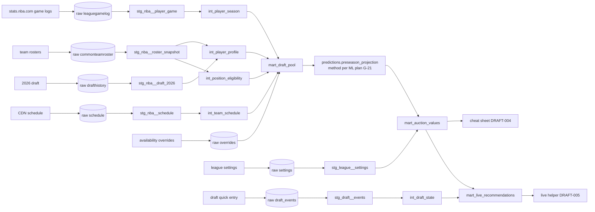

# Data Pipeline Design

Version 0.1 · 2026-09-25 · **Part 1: the draft slice** (DATA-027 → gate **G-22**). Part 2 (the in-season platform) follows in DATA-000 → G-20.
Status: **PROPOSED, awaiting owner approval.** Nothing beyond raw capture is built until approved.

Governing decisions: medallion with dbt-native names (S-10 B), BigQuery everywhere (ADR-0020), immutable raw + bitemporal (ADR-0005), own ingestion layer (ADR-0007), Yahoo via assisted import (ADR-0025, D-45).

---

## 0. What the draft slice must produce
For the **auction on Sun 18 Oct 2026, 17:00 AEDT** (16 teams, $200, H2H 9-cat):
1. a **player pool**: every player who could be drafted, with position eligibility, age, experience, and team (including changes)
2. **preseason season projections** per player for the 9 categories (with uncertainty and expected games), per the ML plan (G-21)
3. **auction $ values** (overall, by position, with punt variants) for the cheat sheet
4. the **live draft state** (who's taken, by whom, at what price; each team's remaining budget) for the live helper

## 1. Source inventory (all confirmed)
| # | Source | What we take | Cadence | Access | Evidence |
|---|---|---|---|---|---|
| S1 | stats.nba.com `LeagueGameLog` (P, T) | player and team game logs, 2023-24 … 2025-26, plus 2015-16 … 2022-23 for the backtest and aging (D-49 Q4) | one-off backfill + re-pull before the draft | home IP, 1.0 s pacing | DISC-003 ✅ |
| S2 | stats.nba.com `LeagueDashPlayerStats` | season per-game/total stats (cross-check of S1 aggregates) | one-off | home IP | DISC-003 ✅ |
| S3 | stats.nba.com `CommonTeamRoster` ×30 | the current 2026-27 rosters: player_id, team, **position (G/F/C, e.g. F-C)**, birth date, age, experience, how acquired | daily until the draft (rosters change in the preseason) | home IP | checked 2026-09-25 ✅ |
| S4 | stats.nba.com `DraftHistory` (2026) | the 60 draftees: player_id, overall pick, team | one-off | home IP | checked 2026-09-25 ✅ |
| S5 | cdn.nba.com `scheduleLeagueV2` | the 2026-27 schedule (games per team, back-to-backs) | daily | anywhere (browser headers) | DISC-004 ✅ |
| S6 | Yahoo league settings (owner import) | format, 9 categories, roster slots, budget, teams | once (done) | owner paste | 2026-09-25 ✅ |
| S7 | **Draft picks (owner quick entry)** | player, winning team, price, nomination order | live on draft day | the owner's phone/laptop | DRAFT-005 |
| S8 | **Availability overrides (owner/Claude-curated)** | known long-term absences at draft time, e.g. "out until Jan" | ad hoc before the draft | a small CSV in the repo (public news only) | new (see §7 Q2) |

**Not available** (the Yahoo API is closed): Yahoo's own position eligibility, Yahoo's default $ values, and ADP. See §7 Q1 for the position-eligibility approach.

## 2. Layers and tables (the draft slice)

Every table carries `observed_at` (when we captured it). Time-varying facts also carry `valid_from/valid_to`. Other managers are pseudonymised at raw write.

### raw (bronze): immutable files in GCS, exposed as BigQuery external tables
| Table | Grain | From |
|---|---|---|
| `raw.nba_stats__leaguegamelog` | one payload per (season, P/T) per fetch | S1 |
| `raw.nba_stats__leaguedashplayerstats` | payload per season per fetch | S2 |
| `raw.nba_stats__commonteamroster` | payload per team per fetch | S3 |
| `raw.nba_stats__drafthistory` | payload per fetch | S4 |
| `raw.nba_cdn__schedule` | payload per fetch | S5 |
| `raw.owner_import__league_settings` | payload per import | S6 |
| `raw.owner_import__draft_events` | one event per entered pick/correction | S7 |
| `raw.owner_import__availability_overrides` | file version | S8 |

### staging: typed, deduplicated, one model per source
| Model | Grain · key | Key columns | DQ tests (error / warn) |
|---|---|---|---|
| `stg_nba__player_game` | player × game · (player_id, game_id) | minutes, FGM/FGA, FTM/FTA, 3PM, PTS, REB, AST, STL, BLK, TOV, season, game_date_et | unique key; FGM ≤ FGA; minutes 0–60; each game's team points = the team log (**error**) |
| `stg_nba__team_game` | team × game | pace inputs, points | unique; 82 games per team per season (**warn** if not) |
| `stg_nba__roster_snapshot` | player × team × observed_at | position, birth_date, experience | player_id not null; position ∈ {G, F, C, G-F, F-G, F-C, C-F} |
| `stg_nba__draft_2026` | player | overall_pick, team | 60 rows (**error**) |
| `stg_nba__schedule_2026_27` | game | game_id, tipoff_utc, game_date_et, home, away | 1,230 regular-season games (**error**) |
| `stg_league__settings` | league × observed_at | format, categories, slots, budget, teams | exactly 9 categories; budget = 200; teams = 16 |
| `stg_draft__events` | event | player_id, team_slot (pseudonymised), price, ts | price 1–200; no player drafted twice (**error**) |

### intermediate: business logic
| Model | Grain | Purpose |
|---|---|---|
| `int_player_season` | player × season | totals and per-36 rates from the game logs; games played; minutes per game |
| `int_player_profile` | player (as of the draft) | age at the season midpoint, experience, current team, **team-change flag** (2025-26 vs 2026-27), draft pick (rookies) |
| `int_position_eligibility` | player | G/F/C eligibility derived from NBA positions (§7 Q1) |
| `int_team_schedule` | team × fantasy week | games per week, back-to-backs (for later in-season use; also the season total) |
| `int_draft_state` | as of each event | taken players, each team's spend, remaining budget, max bid, open roster slots |

### marts / serving (the draft)
| Model | Grain | Consumed by |
|---|---|---|
| `mart_draft_pool` | player | projection inputs: the 3-season history + profile + eligibility + overrides |
| `predictions.preseason_projection` | player × stat (mean, sd) + expected games | valuation (the output of the G-21 method) |
| `mart_auction_values` | player × variant (overall, by position, punt-X) | the cheat sheet (DRAFT-004) and live-helper baseline values |
| `mart_live_recommendations` | as of each draft event | the live helper (DRAFT-005): best targets and bid ceilings for the owner's build |

## 3. Lineage

## 4. Model-input matrix
| Consumer | Inputs | Output |
|---|---|---|
| Preseason projection (DRAFT-002, method per G-21) | `mart_draft_pool` | `predictions.preseason_projection` |
| Auction valuation (DRAFT-003) | projections + `stg_league__settings` + `int_position_eligibility` | `mart_auction_values` |
| Live helper (DRAFT-005) | `mart_auction_values` + `int_draft_state` | `mart_live_recommendations` |
| **Backtest** (the evidence for G-21) | the same pipeline with `as_of` = pre-2025-26 (only ≤ 2024-25 data) | error vs realised 2025-26 |

## 5. Point-in-time and leakage controls
- **as_of for the draft** = 2026-10-18T06:00Z (draft start). Every input must have `observed_at` ≤ as_of.
- **Backtest as_of** = the start of 2025-26. Game logs are filtered to seasons ≤ 2024-25, rosters use the preseason 2025-26 snapshot, and ages are computed at the 2025-26 midpoint. A test fails the build if any row has season ≥ the target season (the DRAFT-002 AC).
- Availability overrides must cite a public source dated before as_of (recorded in the CSV).

## 6. Where it runs
- The draft slice runs in **BigQuery (dev project)**, per ADR-0020. That requires INFRA-001/002 (the Terraform bootstrap + buckets/datasets) to be **applied** before DRAFT-001. Applying creates GCP resources, which is a Tier B action needing your approval (see §7 Q3).
- stats.nba.com pulls run on the laptop (home IP), writing raw files to GCS.

## 7. Owner answers (2026-09-25, D-47)
- **Q1**: both (derived eligibility + an optional Yahoo list paste to correct it). **Q2**: curated overrides file. **Q3**: approve apply after reviewing the plan summary.

### Original questions
- **Q1: Position eligibility.** Yahoo's eligibility (G/F/C) isn't available without the API. Options:
  - (a) derive it from NBA positions (G → G; F → F; C → C; hybrids → both), which is ★ free and a close approximation
  - (b) paste Yahoo's pre-draft player list once (gives the exact eligibility + Yahoo $ values)
- **Q2: Long-term injuries at draft time.** A small, curated "availability overrides" file (e.g. "out until January"), maintained by Claude from public reports before the draft and reviewed by you ★, or no overrides.
- **Q3: Infrastructure timing.** Approve INFRA-001/002 `terraform apply` this week, so the draft pipeline runs on BigQuery as designed ★. The alternative, a temporary local run for the draft only, would deviate from ADR-0020.
