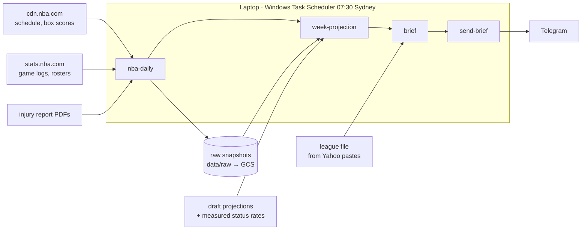
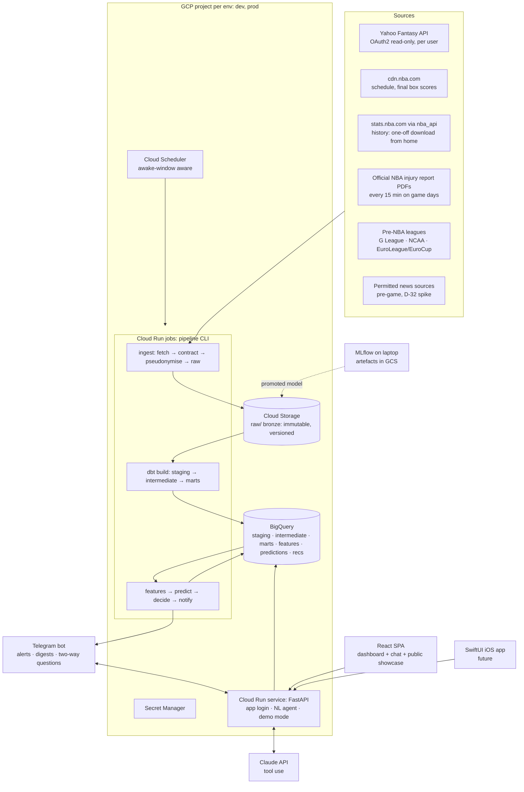
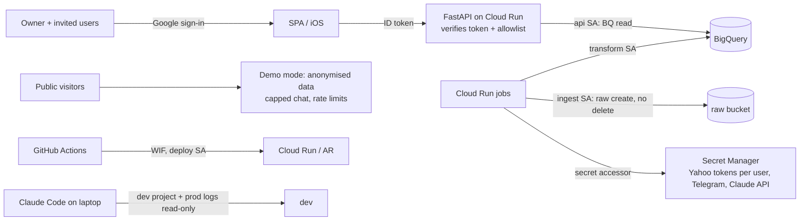

# System Architecture

Version 0.3 · 2026-09-28 · Status: **Approved** (G-00, 2026-09-24; 0.3 records owner decisions D-58, D-59 and
the as-built state, and makes no new decisions).
Decision register: [`docs/project/architecture-decisions.md`](../project/architecture-decisions.md) (D-xx, F-x, P-x, I-x, U-x) and
[`standards-decisions.md`](../project/standards-decisions.md) (S-xx). ADRs are in `adr/`.

## 0. As built (2026-09-28)

Sections 1-11 describe the **target** design. This section says what exists today, so a reader can tell
built from planned.

| Area | Built | Planned next |
|---|---|---|
| Infra | GCP dev/prod projects, WIF, per-workload service accounts, raw buckets (prod: versioned, 30-day retention policy, not locked), BigQuery datasets, budget alert, Terraform policy tests | Secret Manager + Artifact Registry (INFRA-003), Cloud Run jobs + Scheduler (INFRA-004), Firebase Hosting (WEB-012) |
| Ingestion | `SnapshotStore` (write-once, sidecars), `PacedClient`; stats.nba.com history 2015-16 onwards, pre-season logs + starts, rosters; **daily**: cdn.nba.com schedule + final box scores, current game logs, official injury report PDFs (all layouts since 2021-22) | Yahoo assisted import (DISC-011, after the draft), news (DISC-008, in season) |
| Warehouse | dbt staging + intermediate for NBA stats and pre-season role; reconciliation tests; `dbt build` on every PR in per-PR datasets | marts, injury-report staging, CDN box-score staging |
| Models | draft slice: H1+aging(+M1/M1pre) projections, auction values, breakout chances (all backtested, pre-registered gates); rest-of-week projections with **measured** injury-status play rates (MVP-002) | in-season projection models (RSCH-004, G-19) |
| Decisions | draft live helper; daily brief rules (lineup, matchup outlook, pickups) | simulator + lineup MILP (DEC-003/007) |
| Delivery | draft board artifact; daily brief to Telegram (`daily-run`, Windows Task Scheduler 07:30 on the laptop) | Cloud Run schedule, API (APP-001+), website live |
| Web | `apps/web` SPA on sample fixtures (Today B, Matchup A, Waivers A) | API client (APP-003), hosting (WEB-012) |
| CI | 7 required checks on `main` (lint-type, test-py, docs, security, terraform, dbt, web); squash merges via PR only | deploy jobs |

### 0.1 The MVP path (in-season, from 20 Oct 2026)



Baselines only: per-game draft projections × games left × availability (measured rates by injury status).
It moves to Cloud Run jobs in INFRA-004 without code changes (the same CLI).

### 0.2 Three layers (D-58)

| Layer | Contents here | Rule |
|---|---|---|
| Harness | CLAUDE.md, tasks CLI + task standard, gates, decision menus, skills/agents, CI + ruleset, standards, lessons ledger | project-agnostic (harness-manifest.yaml) |
| Platform kernel | snapshot store, paced client, clock/as-of, dbt layout, backtest + bootstrap + gates, shrinkage/ridge/logistic, decision/explanation contracts, Terraform env module, web shell | never imports domain code (GEN-003 enforces it) |
| Domain pack | NBA/Yahoo sources, staging SQL, league rules, projections, valuation, brief rules, screens | may use the layers below |

Plan and proof (a Sydney housing domain): `docs/platform/generalisation-plan.md`.

## 1. Overview

A **GCP-serverless, API-first analytical application** in a Python monorepo. It is small-multi-user ready (D-31), and
**Telegram is the primary interface**. There is also a React dashboard with a natural-language chat, a public showcase,
and, later, a native iOS app.



## 2. Separating artefact types (unchanged principle)

| Artefact | Example | Produced by | Stored in |
|---|---|---|---|
| Raw fact | Yahoo roster JSON at 09:00Z (pseudonymised) | ingest | `gs://…-raw-{env}/` + manifest |
| Clean fact | player X scored 31 on 2026-11-02 | dbt staging/marts | BigQuery `marts.fct_player_game` |
| Derived metric | 14-day per-36 rates, G-scores | dbt marts / feature views | BigQuery `marts`, `features` |
| Prediction | P(plays) = 0.82; PTS ~ NegBin(μ, k) | models | BigQuery `predictions` (keyed by `as_of`, model version) |
| Optimisation output | the best lineup for 2026-11-04 | decision.optimiser | in memory → the recommendation log |
| Rule | "never drop an IL+ player returning ≤ 3 days" | decision.rules | versioned code |
| Recommendation | "Start Y over Z" | decision.engine | BigQuery `recs.recommendation` |
| Explanation | "Y has 2 games vs Z's 1; +0.4 expected cats" | decision.explain | inside the recommendation (template id + evidence refs) |
| Answer (NL question) | "Walker, for blocks: +0.4 cats…" | API agent (LLM + tools) | `recs.qa_log`, with the tool calls cited |

## 3. Components and repository (D-02, D-03)

| Component | Path | Responsibility |
|---|---|---|
| core | `packages/core` | settings, structured logging (structlog JSON → Cloud Logging), `Clock`/`AsOf`, IDs, `LeagueRules` (all 5 Yahoo formats), storage abstraction (fsspec: local path or `gs://`), BigQuery client wrapper |
| ingest | `packages/ingest` | source clients (Yahoo per user, NBA CDN, NBA stats, injury PDFs, pre-NBA leagues, news), rate limits/retries, Pydantic contracts, **pseudonymiser**, snapshot store + manifest, quarantine |
| warehouse | `warehouse/` (dbt-bigquery) | `staging/` → `intermediate/` → `marts/`, dbt tests, snapshots (SCD2), contracts, docs/lineage |
| features | `packages/features` | point-in-time feature views over BigQuery via `AsOfReader(t)`; leakage harness |
| models | `packages/models` | baselines, cold-start priors (D-40), minutes, rate, and availability models; MLflow tracking; inference |
| decision | `packages/decision` | simulator, `ScoringObjective` per format, lineup MILP (HiGHS), valuation, rules, evidence + explanations, rec log |
| evaluation | `packages/evaluation` | walk-forward backtests, replay, outcome scoring, calibration, promotion gate |
| pipeline | `apps/pipeline` | Typer CLI; job DAG; partitioned idempotent jobs; change detection → event queue (D-33); notifications |
| api | `apps/api` | FastAPI: read endpoints, app login verification, NL question agent (D-36), demo mode (D-38) |
| bot | `apps/bot` (in the api service) | Telegram webhook: alerts, digests, buttons, two-way questions (D-34) |
| web | `apps/web` | React + TS + Vite + TanStack Query + shadcn/ui + Tailwind; Today/Matchup/Waivers/Players/Trades/System/Chat; public showcase |
| ios | `apps/ios` (future) | SwiftUI client generated from OpenAPI (D-39) |
| infra | `infra/terraform` | projects, buckets, datasets, IAM, WIF, Secret Manager, Artifact Registry, Cloud Run, Scheduler, budgets, monitoring |

**Import rules** (import-linter):
- `core ← ingest`
- `core ← features ← models ← decision`
- `evaluation` may read features/models/decision
- apps may import packages; packages never import apps

## 4. Data platform

### 4.1 Storage layout
As built: `raw/{source}/{endpoint}/{key}/{observed_at}.{json|pdf}` + a `.meta.json` sidecar per snapshot (the
manifest row; GCS objects can't be appended to). The target layout below is kept for reference.
```
gs://<prefix>-raw-{env}/raw/{source}/{endpoint}/dt=YYYY-MM-DD/{observed_at}_{sha8}.json.gz   # immutable
gs://<prefix>-raw-{env}/raw/_manifest/…                                                     # one row per payload
gs://<prefix>-raw-{env}/raw/_quarantine/…                                                   # failed contracts
gs://<prefix>-exports-{env}/bigquery/…                                                       # weekly BigQuery exports
gs://<prefix>-mlflow/…                                                                        # MLflow artefacts + promoted models
BigQuery (per env project): staging · intermediate · marts · features · predictions · recs · ops (job_runs, dq_results)
```
- Prod raw: object versioning + a retention policy, so nothing can be deleted by accident. Ingest has write access and no delete access.
- Dev reads prod raw **read-only** (I3). Dev buckets expire after 30 days.
- The historical stats.nba.com download runs once from the home IP, and its files are uploaded to prod raw.

### 4.2 Layers (medallion concept, dbt-native names; S-10 B)

| Layer | Where | Rules | Gate to enter |
|---|---|---|---|
| **raw** (bronze) | GCS files, exposed as BigQuery external tables/sources | Append-only; manifest per payload; **Yahoo payloads pseudonymised before writing** (G-04 A2) | Pydantic contract + manifest integrity |
| **staging** (silver) | `stg_<source>__<entity>`, `snp_*` | Typed, deduplicated, `observed_at` preserved, SCD2 snapshots for state | dbt tests: unique, not_null, accepted range/values, freshness |
| **intermediate** | `int_*` | Joins and crosswalks (NBA↔Yahoo↔pre-NBA IDs), bitemporal state | dbt relationship + reconciliation tests |
| **marts** (gold) | `dim_*`, `fct_*`, `mart_*` | Conformed dimensions and facts; decision-shaped marts; `LeagueRules`-generated macros | dbt business-rule tests |
| serving | `features`, `predictions`, `recs` | Point-in-time feature views, predictions, recommendations | leakage tests, model gate |

**Multi-user keying (D-31)**: user- and league-specific tables carry `league_key` (+ `user_id` where relevant). NBA facts are shared.

### 4.3 Scoring formats (ADR-0018)
`LeagueRules.format` selects a `ScoringObjective` (H2H Categories, H2H One Win, H2H Points, Rotisserie, Points). Nothing
else branches on the format. There is one golden fixture per format.

### 4.4 Orchestration and scheduling (D-10, D-28, D-33, NFR10)
- Jobs are `run(partition, ctx) -> JobResult`: idempotent and catch-up aware. The same CLI runs locally and in Cloud Run jobs.
- **Poll on a schedule, process on change**: lightweight pollers fingerprint each response. A changed fingerprint that affects a user's players, their opponent, or their watchlist triggers a targeted recompute. A notification is sent only if a recommendation materially changes.
- **Cloud Scheduler** triggers the jobs. Cadence (Sydney time; configurable per user):

| Job | Cadence |
|---|---|
| nightly (box scores, dbt, predictions, tomorrow's plan + evening digest) | once, ~6pm |
| Yahoo league snapshot | once daily |
| FA/transactions poll | hourly, inside the awake window |
| injury report poll | every 15 min on game days, inside the awake window |
| news extraction | T-90/T-45 min before relevant games (pending the D-32 spike) |
| final lineup check | T-30 min per relevant game |
| morning catch-up | at the start of the awake window |

- **Awake window (NFR10)**: nothing user-facing runs outside it. Overnight changes are consolidated into the morning catch-up, and the evening digest flags games that lock early. Injury history is backfilled from the NBA archive rather than polled overnight.
- Upgrade trigger: more than ~15 jobs, or backfill pain → reconsider Dagster.

### 4.5 Data quality (S-11 A, S-12 A)
- Six dimensions: validity, uniqueness, completeness, consistency/reconciliation, timeliness, referential integrity.
- Implemented with **dbt tests** (+ dbt_utils / dbt_expectations), Pydantic at ingest, and Pandera on feature frames.
- `error` blocks promotion to the next layer and sends a Telegram alert. `warn` promotes the data and flags it.
- Results go to `ops.dq_results`, which feeds the dashboard's System page.
- Anomaly checks run on row counts and key distributions.

## 5. Intelligence and decisions (details: `ml-and-decision-design.md`)

- **Projections (D-16)** are decomposed into availability × minutes × per-minute rates. Baselines come first, and ML replaces them only through the gate.
- **Cold start (D-40)**: league-translated pre-NBA stats plus draft/age/position priors, blended with NBA data via empirical Bayes.
- **Uncertainty (D-17)**: negative-binomial counts, with makes/attempts modelled jointly.
- **Availability (D-18)**: staged, from a lookup table to logistic regression to calibrated GBM.
- **Valuation (D-19)**: Monte Carlo simulation, with a format objective and common random numbers.
- **Lineup (D-20)**: MILP with HiGHS.
- **Validation and gate (S-16, S-17)**: walk-forward by week; paired block bootstrap + DM test.
- **Tracking (D-37)**: MLflow on the laptop, artefacts in GCS. Promoted models are exported to GCS, and the Cloud Run jobs load them. Weekly retraining runs when the laptop is on.
- **Explanations (D-22)**: templates + SHAP, with a number round-trip test.
- **NL questions (D-36)**: the Claude API with tool use over vetted functions (projections, matchup state, what-if, comparisons, recommendation history). Every number must come from a tool result (tested). Per-user and global caps apply.

## 6. Interfaces (U1–U8)
- **Telegram-first**: compact messages with buttons, e.g. [Open Yahoo] [Why?] [Alternatives]. Urgent, opportunity, and digest types; quiet hours; per-user chat ID.
- **Dashboard**: the home screen is "Today: actions first". Recommendations are action cards with an expandable "why". Statistics are simple by default, with drill-down. The theme follows the phone setting. shadcn/ui + Tailwind.
- **Design approval**: a clickable prototype (WEB-000) before any real frontend work.
- **Public showcase (D-38)**: a case-study page and a read-only demo mode on anonymised/replayed data, with a capped live demo chat. It launches with the dashboard (Phase 7).
- **iOS (D-39, future)**: a native SwiftUI client over the same OpenAPI contract. Builds need macOS (G-18).

## 7. Environments and deployment (I1–I6, S-22)

| Env | Where | Data | Purpose |
|---|---|---|---|
| local | laptop | dev GCP project (BigQuery dev datasets; reads prod raw read-only) | development, agent work, MLflow, stats.nba.com history download |
| ci | GitHub Actions | ephemeral per-PR BigQuery datasets in dev + recorded fixtures | gates |
| dev | GCP dev project | dev datasets; auto-deployed on merge to `main` | integration |
| prod | GCP prod project | live | daily use + public showcase |

- **Terraform** manages everything, with state in a locked GCS bucket.
- CI authenticates with **Workload Identity Federation**, so there are no keys. Prod deploys are allowed only from `main` via a CalVer tag, with a health check and automatic rollback.
- Images live in Artifact Registry. There's one image with several entrypoints (modular monolith).
- **Website (D-59)**: Firebase Hosting in each env project (CDN, a preview channel per PR, `/api/**` rewritten to the
  Cloud Run API); merge → dev, CalVer tag → prod; the free `<project>.web.app` address. Public demo on sample data;
  the real app behind Google sign-in + allowlist.
- **CI (as built)**: 7 required checks on `main`; `dbt build` runs per PR in labelled `ci_pr<N>_*` datasets that are
  dropped afterwards (a nightly job removes leftovers).

## 8. Security boundaries (I5, I6, D-27, D-38)



- **App-level login**: Firebase Auth / Identity Platform Google sign-in, with an email allowlist. Every request is verified server-side. Rate limits apply. A security review is required (APP-005).
- Each workload has its own **least-privilege service account**. The owner is break-glass admin. **Claude has dev access plus read-only prod logs/metrics; prod changes happen only via CI.**
- **Secrets** live in Secret Manager per environment. Yahoo refresh tokens are stored per user and rotated as new versions.
- **Privacy**: other managers are pseudonymised at ingestion. League data is never displayed publicly; the showcase uses anonymised data. `just purge-yahoo` deletes all Yahoo-derived data.
- **Public repo** (after the SEC-001 audit): server-side rulesets on `main`; gitleaks; scrubbed fixtures.

## 9. External dependencies and failure modes

| Dependency | Failure mode | Mitigation |
|---|---|---|
| Yahoo API | token expiry, schema drift, throttling, key revocation | per-user refresh + alert; contract tests; backoff; purge switch |
| cdn.nba.com / injury PDFs | URL/format change; possible cloud blocking (UNVERIFIED from GCP; works from home) | contract tests; DISC-004/005 test reachability from GCP; BALLDONTLIE/MySportsFeeds fallbacks evaluated |
| stats.nba.com | blocked from the cloud | a one-off home download, uploaded |
| Pre-NBA sources | terms/format changes | DISC-010 permitted sources; optional feature (cold start degrades to priors) |
| Claude API | outage/cost | caps; the dashboard and alerts work without it (templated explanations) |
| GCP | cost overrun | a budget alert at US$10 → Telegram |

## 10. Major trade-offs

| Decision | Chosen | Gave up | Why acceptable |
|---|---|---|---|
| BigQuery everywhere | a single SQL dialect; serverless fit | offline tests and a local-speed dev loop | the owner accepted credential management; unit tests stay offline |
| Cloud Run + Scheduler | ~$0, serverless, GCP skills | an always-on process's simplicity | the awake-window cadence fits scheduled jobs |
| Own ingestion layer | exact raw snapshots, PDFs, pseudonymisation | dlt conveniences | 6 source families; one mechanism |
| MLflow on the laptop | $0, industry-standard | a hosted registry | retraining isn't time-critical |
| App-level login | multi-user + iOS-ready | IAP's zero-code security | security review task; IAP remains the fallback |
| Native SwiftUI (future) | best iOS experience | code sharing with web | the API-first contract keeps the clients thin |

## 11. Abstractions from day one vs start simple
- **Day one**:
  - `Source` protocol + snapshot store
  - storage abstraction (local/GCS)
  - `Clock`/`AsOf`
  - `LeagueRules` + `ScoringObjective`
  - `Projector` interface
  - the `Recommendation` schema
  - the partitioned job interface
  - league/user keying
  - the OpenAPI contract
- **Start simple**:
  - orchestration (CLI → Dagster on the trigger)
  - MLflow on the laptop (→ hosted if needed)
  - feature views (no store)
  - one image
  - two environments
