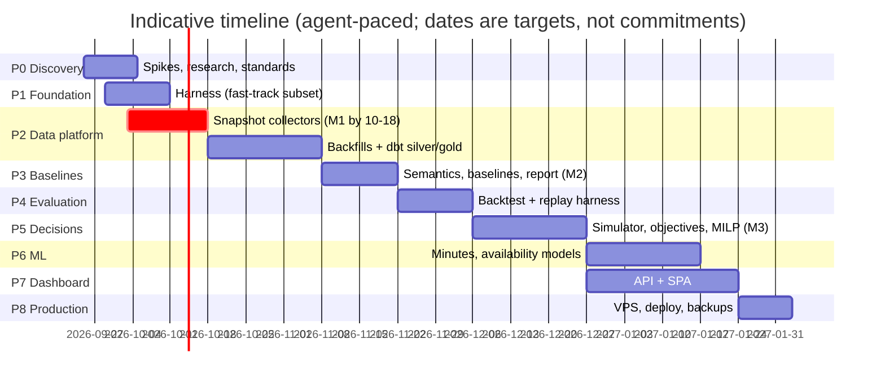

# Roadmap

Version 0.2 · 2026-09-24 · Status: **Approved** (G-00, 2026-09-24). The task-level view is in [`tasks/BOARD.md`](tasks/BOARD.md).

## Guiding sequence
1. **Start the clock**: point-in-time data can't be backfilled, so collection starts before tip-off (20 Oct).
2. **Measure before modelling**: build the evaluation harness before any ML.
3. **Baselines ship first**: useful reports from simple, well-grounded methods.
4. **ML replaces baselines only through the gate.**
5. **The UI comes last**, on top of stable APIs. Markdown reports deliver value until then.

## Phases

| Phase | Goal | Epics | Exit criteria |
|---|---|---|---|
| **P0 Discovery** | Validate assumptions and settle the decisions | EP-00 Governance (STD), EP-01 Discovery (DISC), EP-02 Research (RSCH) | Gates G-00…G-05, G-10…G-13, G-15 answered; A-01…A-05 validated; the literature verified |
| **P1 Foundation** | A harness that lets agents work safely and cheaply, plus the GCP base | EP-10 Foundation (FND), EP-11 Infrastructure (INFRA), EP-95 Paper (PAPER-001) | `just check`/`ci-local` green; CI live; guardrail hooks; pipeline CLI; Terraform dev/prod + buckets/datasets/IAM; Telegram alerting; paper skeleton builds |
| **P2 Data platform** | Medallion platform, with point-in-time collection live | EP-20 Ingestion, EP-21 Warehouse (DATA) | **M1**: daily and intraday snapshots running unattended **before 2026-10-20**; history backfilled; staging/intermediate/marts built in BigQuery with dbt tests; `AsOfReader` + leakage harness |
| **P3 Baseline analytics** | First useful output | EP-30 Semantics, EP-31 Baselines, EP-32 First value (ANL) | **M2**: a daily markdown report (lineup, matchup, streams) from grounded baselines, for any Yahoo format |
| **P4 Evaluation** | Measure everything | EP-40 Evaluation (EVAL) | Baseline backtest and calibration reports; the replay harness; the rec log; `just eval-gate` |
| **P5 Decision engine** | Format-aware optimal decisions | EP-50 Decision engine (DEC) | **M3**: replay shows the engine beating baselines B1/B2 (spec §9); trade and opponent analysis |
| **P6 ML** | Improve the inputs where measurable | EP-60 ML (ML) | Each model is promoted or rejected by the gate, with a committed report |
| **P7 Dashboard & showcase** | A mobile, decision-first UI + NL questions + the public showcase | EP-70 Dashboard (APP, WEB), EP-75 Accounts and leagues, EP-76 Identity and data protection (APP, WEB, INFRA, SEC, RSCH; D-72, D-74), Courtside rebrand (BRAND-001..003), code hygiene (HYG-001..002); APP-024..027 and INFRA-010 are the shared foundations the identity and league tasks build on | Prototype approved (WEB-000); app login; NL agent; top 3 flows e2e-tested; public demo + case study live; repo public (SEC-001) |
| **P8 Production hardening** | Recoverable, monitored | EP-80 Production (PROD) | Cloud Run prod via tags; backups with a tested restore; rollback demonstrated. (The serverless runtime itself arrives earlier, via INFRA-004) |
| **P9 Continuous improvement** | Learn and refine | EP-90 Improvement (IMP, EXP), pre-NBA leagues (low priority: DISC-010, DATA-025, ML-006, RSCH-003) | Agent metrics tracked; monthly improvement loop; cold-start translation; paper on arXiv; iOS app planning (G-18) |

P6 and P7 can overlap, because they are independent after P5.

## Milestones
| ID | What | Target | Why it matters |
|---|---|---|---|
| M0 | Planning baseline approved (G-00, G-10) | 2026-09-28 | Unblocks all implementation |
| **M0.5** | **Draft assistant ready** (cheat sheet + live helper, dry run done) | **Thu 15 Oct 2026** (auction draft Sun 18 Oct 17:00 AEDT) | The single highest-leverage decision of the season |
| **M1** | Point-in-time collection live | **2026-10-18** (tip-off 10-20) | Can't be recovered later; enables honest evaluation of this season |
| M2 | First daily report in use | ~2026-11-15 | The first real value |
| M3 | Decision engine validated by replay | ~2026-12-20 | Evidence the recommendations beat baselines |
| M4 | Dashboard live on the phone | ~2027-01-31 | Convenience and exploration |
| M5 | Production always-on | ~2027-02-15 | Reliability through the fantasy playoffs |

## Parallel workstreams (owner decision 2026-09-25)
- **A: Draft assistant** (M0.5): `FND-002 → FND-007 → DISC-003 → DRAFT-001 → DRAFT-002 → (DISC-001/002) → DRAFT-003 → DRAFT-004`; `DATA-003 → DRAFT-005 → DRAFT-006`.
- **B: M1 collection**: the fast track below.
- They share FND-002/007, DISC-001/002/003 and DATA-003. Each runs in its own git worktree (`.worktrees/<ID>`), with one Claude session per workstream.

## Fast track to M1 (G-15 approved)
The critical path, with only these tasks ahead of everything else:

`FND-001 → FND-002 → FND-007 → FND-010 → FND-011 → INFRA-001 → INFRA-002 → DATA-001 → DATA-002 → (DATA-003 + DISC-001/002) → DATA-004 → DATA-005 → (DATA-006 + DISC-004) → (DATA-007 + DISC-005) → FND-015 → INFRA-003 → FND-012 → INFRA-004 → FND-013 → DATA-008`

- **Owner decision (2026-09-24): cloud from day one.** Collection starts only once it runs on Cloud Scheduler + Cloud Run. The container, secrets and scheduler are therefore on the critical path. **Risk**: M1 may slip past tip-off, and any early-season Yahoo snapshots before go-live are lost (injury history can still be backfilled). Mitigation: the infrastructure tasks get top priority, and the owner is told the moment the slip becomes likely.
- The rest of Foundation (FND-006 CI, FND-008 ship, FND-009 hooks, FND-015 container) runs in parallel or right after M1.
- Doc reconciliation (ARCH-001, STD-001) comes first; it's in progress.

**Owner actions on the critical path:**
- review the reconciled docs (G-00, via panels)
- install Docker Desktop
- sign in to GitHub (`gh auth login`) and Google Cloud (`gcloud auth login`); create a GCP billing account (~10 min)
- register the Yahoo app (~10 min) and run `just yahoo-login` once
- create the Telegram bot with BotFather (~3 min)
