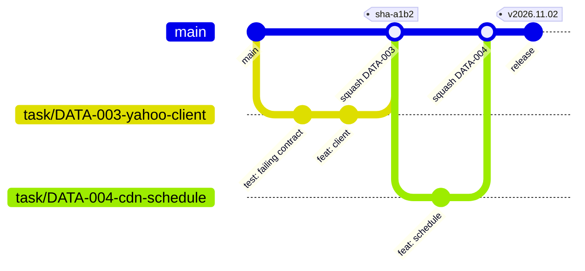

# Git Workflow, Branching & Release Strategy

Status: **Accepted** (owner selections recorded in `docs/project/standards-decisions.md`, 2026-09-24).

Status: **Proposed** (G-01, G-11). Applies to humans and agents.

## 1. Model: trunk-based development with short-lived branches

- `main` is the trunk. It must **always pass CI and always be deployable**.
- All work happens on short-lived branches (target < 1 day, hard limit 3 days). Each is merged with a **squash**, so that **one task = one branch = one PR = one commit on `main`**.
- There are no long-lived `develop` or `release` branches. Git-flow's overhead doesn't pay off for one owner plus agents, and long branches cause merge conflicts between agent sessions.
- Environments are promoted by **tags and artefacts**, not by branches (§5).



## 2. Branch naming

| Prefix | Use | Example |
|---|---|---|
| `task/<ID>-<slug>` | backlog task | `task/DATA-003-yahoo-client` |
| `spike/<ID>-<slug>` | time-boxed investigation. Output is docs and throwaway code, and **the code is never merged**; only `docs/` changes merge | `spike/DISC-001-yahoo-auth` |
| `fix/<ID\|slug>` | bug fix | `fix/injury-parser-page-break` |
| `docs/<slug>`, `chore/<slug>` | docs-only / tooling | `chore/bump-ruff` |
| `exp/<EXP-ID>` | ML experiment. It merges only the report and the promoted config | `exp/EXP-004-minutes-lgbm` |
| `hotfix/<slug>` | urgent production fix (fix-forward on main, fast-tracked) | `hotfix/yahoo-token-refresh` |

The `<ID>` always matches a task file, so `just task show <ID>` works from the branch name.

## 3. Commits

- **Conventional Commits** with scope = component, and the task ID in the trailer:
  ```
  feat(ingest): add Yahoo roster snapshot endpoint

  Task: DATA-006
  Co-Authored-By: Claude …
  ```
  Types: `feat`, `fix`, `refactor`, `test`, `docs`, `chore`, `build`, `ci`, `perf`, `data` (dbt/model-only changes), `exp`.
- The TDD rhythm on the branch (`test:` failing → `feat:` passing → `refactor:`) is encouraged. The squash keeps `main` clean.
- The squash commit message = the PR title + the task ID + a summary of the task file's *Implementation history* entry.
- Never commit secrets, `data/`, model binaries, or `.env*`. pre-commit (gitleaks) and CI enforce this.

## 4. Pull requests and merge policy

Every task file declares `autonomy:`, which sets the merge tier:

| Tier | `autonomy` | Who merges | When |
|---|---|---|---|
| **A** | `auto` | agent via `just ship` | CI green + the `reviewer` subagent returns PASS + DoD checklist complete |
| **B** | `review` | owner | Agent opens the PR and posts a summary; the owner approves (GitHub mobile, or tells Claude "merge PR #n" via Remote Control) |
| **C** | `gated` | owner | Work may not *start* until the linked gate in `human-approval-gates.md` is `APPROVED`; then Tier B |

Defaults:
- Tier B applies to anything touching `.claude/`, `CLAUDE.md`, `docs/standards/`, `docs/architecture/`, CI workflows, `infra/`, security settings, or data retention/deletion.
- Everything else is Tier A.

`just ship` (FND-008):
1. rebase onto `origin/main`
2. `just ci-local`
3. push
4. `gh pr create` with the template
5. wait for checks
6. `gh pr merge --squash --delete-branch`
7. update the task state

It **refuses** to merge if any check fails, the branch is behind, or the task tier is not A.

PR template sections:
- Task ID and link
- Summary
- DoD checklist
- Test evidence (command + result)
- Eval evidence (if ML/decision)
- Risks
- Follow-ups

## 5. Environments, releases, and deployment

| Trigger | Result |
|---|---|
| PR opened/updated | CI: lint, types, unit + contract tests, dbt build on fixtures, import contracts, security scans, eval smoke (if ML changed) |
| Merge to `main` | CI + build the image into Artifact Registry (`sha-<short>`) → **auto-deploy to the dev project** + smoke test |
| `just release` → tag `vYYYY.MM.DD[.N]` (CalVer) on a green `main` commit | Deploy workflow promotes the *same image digest* to **prod**, runs a health check, and **rolls back automatically** to the previous tag if the check fails |
| `just rollback <tag>` | Redeploys a previous image digest. Data rollback uses BigQuery time travel / the weekly export (bronze is immutable, so silver/gold can always be rebuilt) |

- **CalVer** fits a continuously deployed personal app better than SemVer, because it has no external API consumers.
- SemVer is used for agent/skill specs and for the internal package `__version__`s (these only need to exist).
- **Models are versioned separately from code**:
  - **MLflow** (on the laptop, artefacts in GCS) tracks runs and the registry. Promoted models are exported to a versioned GCS path, and prod reads the current `champion`.
  - **Promotion is automatic on a gate PASS** (owner decision 2026-09-24): the MLflow `champion` alias + GCS export + a Telegram note. The evaluation report is committed through the normal task flow. `just model-rollback <name>` restores the previous champion.
- **Hotfixes**: branch from `main`, fix forward, Tier B fast path, then release a new CalVer tag. We never patch a tag in place.

## 6. Branch protection (G-01 C: public repo)

**Selected 2026-09-24**: the repo becomes **public** after the SEC-001 audit. That enables free **server-side rulesets** on `main`: required CI checks, no force-push or deletion, linear history, and squash-only merges. The local hooks below remain as a second layer. The historical analysis follows.

### 6a. Historical analysis

Private repos on GitHub Free cannot use branch protection, rulesets, or environment reviewers (verified 2026-09-24). The options:

| Option | Cost | Enforcement |
|---|---|---|
| **1. Private + Free + local enforcement (recommended to start)** | $0 | (a) a pre-push hook rejects direct pushes to `main` except by `just ship` / `just release`, (b) a Claude Code `PreToolUse` hook denies `git push … main`, `--force`, `reset --hard` on main, (c) CI runs on every push to `main` and alerts on red, (d) prod deploys require a manual `workflow_dispatch` that only the owner can trigger |
| 2. Private + GitHub Pro | ~$4/mo | Real branch protection: required checks, no force-push, required review for Tier B paths via CODEOWNERS |
| 3. Public repo | $0 | Full protection features; **but** league data in fixtures must be scrubbed, and the architecture becomes public. Not recommended |

The move from option 1 to option 2 is a single settings change. Trigger for upgrading: any unreviewed or red commit lands on `main`.

## 7. Parallel work and worktrees

- The default is **one active task at a time** (it's cheaper on Claude Pro; see the agent architecture §8).
- When two independent tasks run in parallel (e.g. a long backfill plus docs), each gets a worktree at `.worktrees/<ID>` (gitignored) or via the `isolation: worktree` subagent setting. Each worktree gets its own branch per §2.
- Task files are the lock: `status: in_progress` + `assignee: <session>` prevents two sessions from taking the same task. `just task claim <ID>` enforces this.

## 8. Dependency updates

- Dependabot runs weekly with grouped PRs (python, npm, actions).
- The agent triages them in the weekly maintenance task: it merges patch/minor updates when CI is green (Tier A) and treats majors as Tier B.
